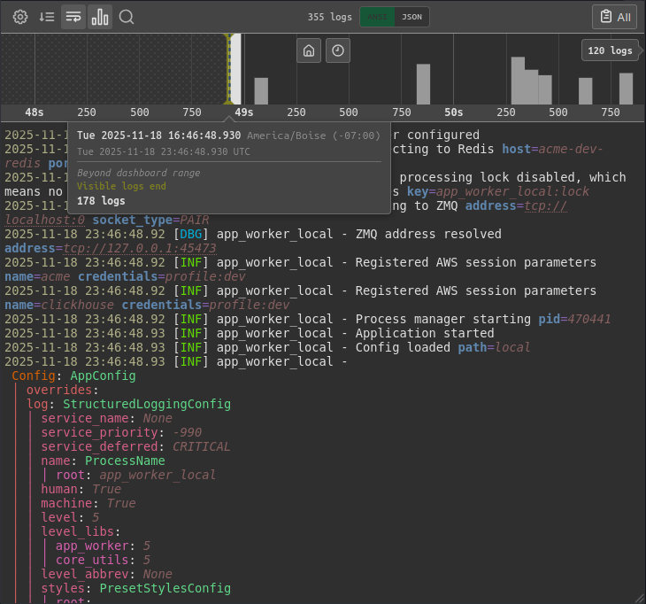
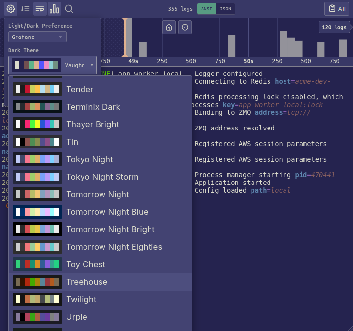
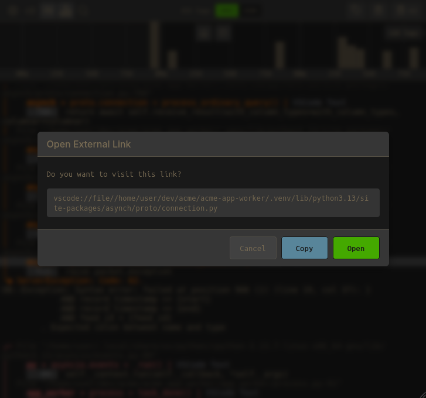
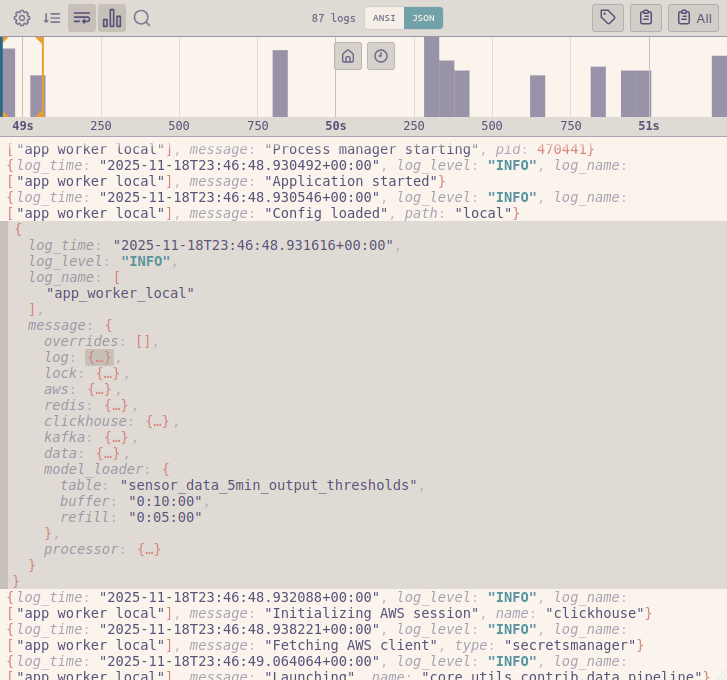

#  Pyris

A log viewer panel for Grafana with JSON and ANSI styling support. It provides themes to
match your favorite terminal emulator or IDE, and a timeline chart for quick navigation.

## Screenshots

<table>
  <tr>
    <td></td>
    <td></td>
  </tr>
  <tr>
    <td></td>
    <td></td>
  </tr>
</table>

## Features

**300+ built-in color themes** from [Gogh](https://gogh-co.github.io/Gogh/) terminal themes, plus two custom Grafana light/dark terminal themes. View logs with the same ease
as your terminal or code editor.

### ANSI logs:
- Full styling support (colors, underline, italic, etc)
- Link support (OSC links), with link navigation confirmation for security
- Regex and case-sensitive filtering

### JSON logs:
- Automatic detection of JSON log line
- Collapsible nested objects and arrays
- Syntax highlighting using terminal color theme
- Expression-based filtering (e.g., `r.level == "error"` or `r.status >= 400`)

### Log timeline chart:
- Histogram visualization of log density over time
- Quickly navigate, then sync the Grafana dashboard to your current view
- Cursor synchronization across panels (shared crosshair)

### Performance Optimized
- Virtual scrolling for handling large log volumes
- Configurable row limits and line length truncation
- Efficient memory usage with lazy rendering

### Additional Features
- View log labels as badges or in a popup modal
- Easily copy full logs, a single log line, or individual fields

## Installation

### Manual Installation

1. Download the latest release from the [releases page](https://github.com/Azmisov/pyris/releases)
2. Extract to your Grafana plugins directory (e.g., `/var/lib/grafana/plugins/`)
3. Restart Grafana

### From Grafana Catalog (Pending!)

1. In Grafana, go to **Configuration > Plugins**
2. Search for "Pyris"
3. Click **Install**

## Configuration

### Panel Options

| Option | Description |
|--------|-------------|
| **Default Dark Theme** | Color scheme when Grafana is in dark mode |
| **Default Light Theme** | Color scheme when Grafana is in light mode |
| **Font Family** | Monospace font for log display |
| **Show Labels** | Display log labels as inline badges |
| **ANSI Max Line Length** | Truncate lines beyond this character count |
| **Max Renderable Rows** | Performance limit for total rendered rows |

### Data Source Requirements

This panel works with any data source that returns log data in a standard format:

- **Time field**: Timestamp for each log entry
- **Message/Body field**: Log content (string) - can contain ANSI codes or JSON
- **Labels** (optional): Key-value metadata attached to log lines

## Contributing

See [CONTRIBUTING.md](CONTRIBUTING.md) for development setup and guidelines.

## License

LGPL-3.0 - see [LICENSE](LICENSE) for details.
